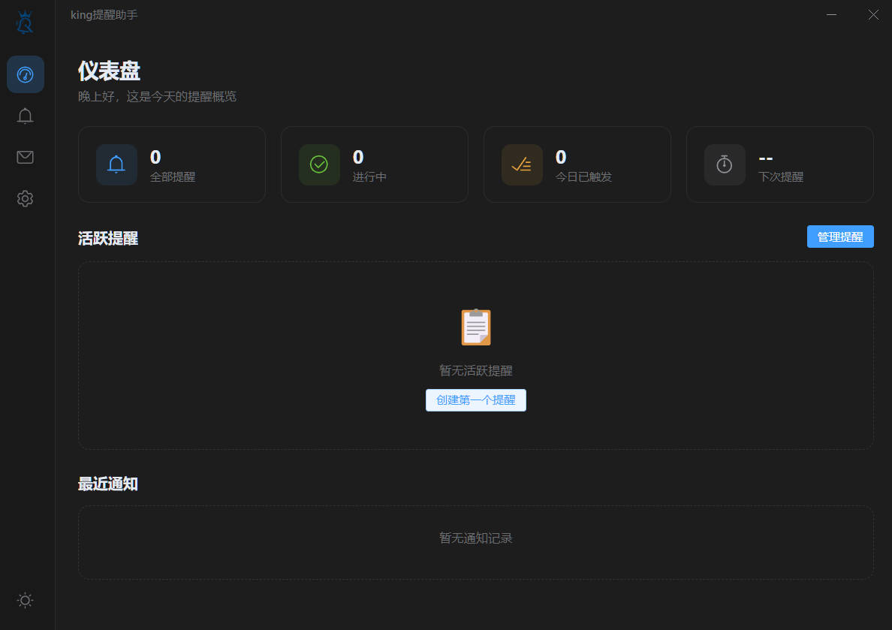
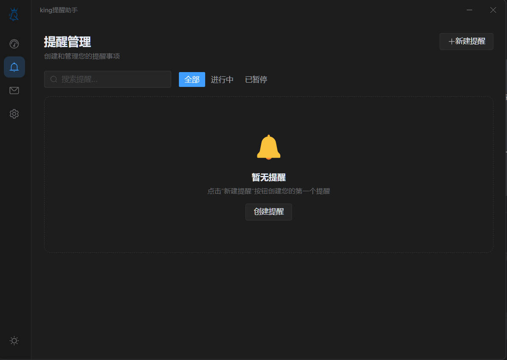
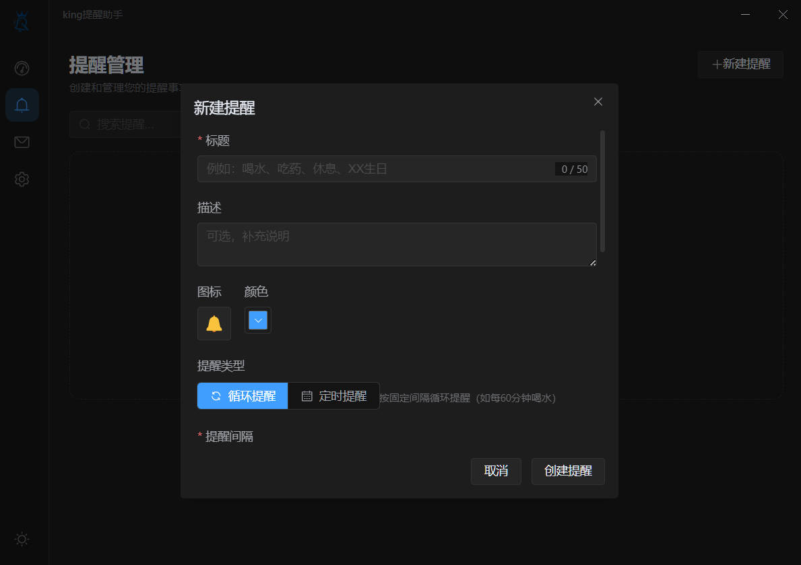
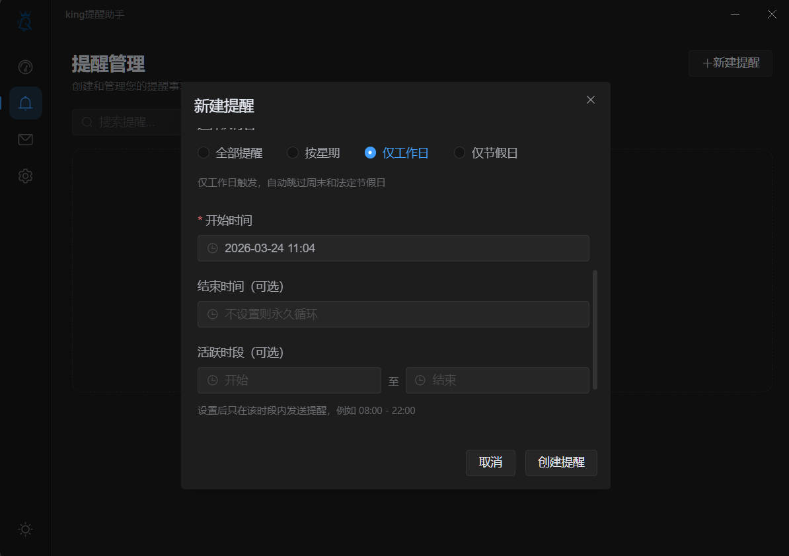
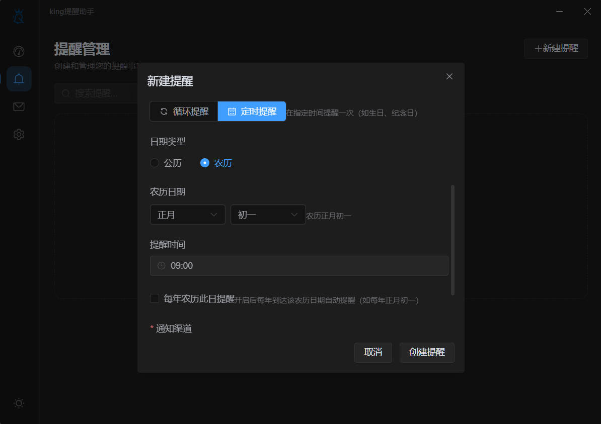
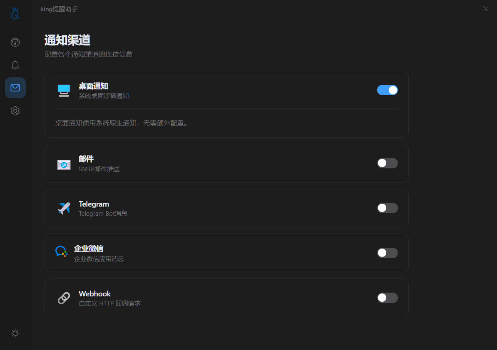
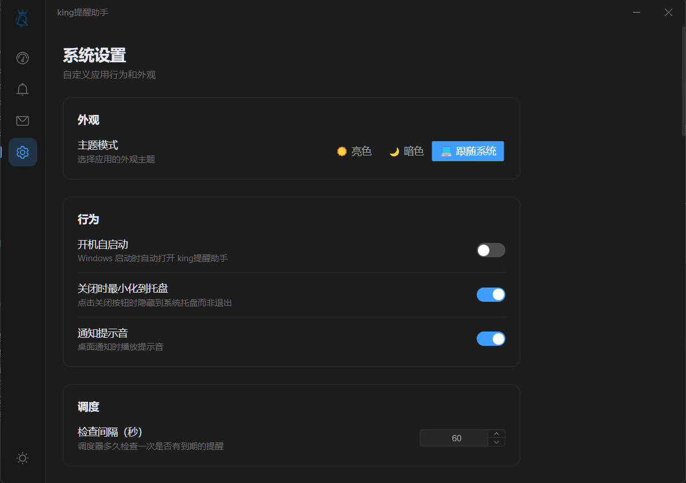
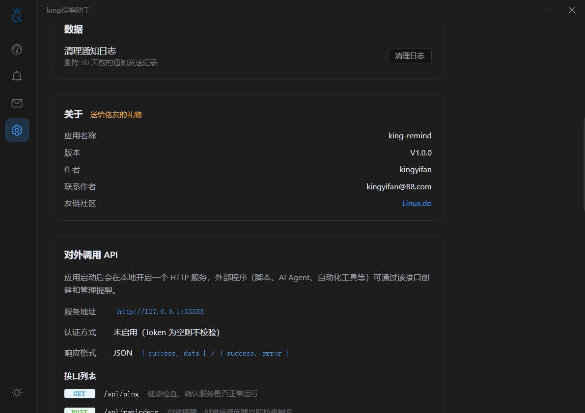
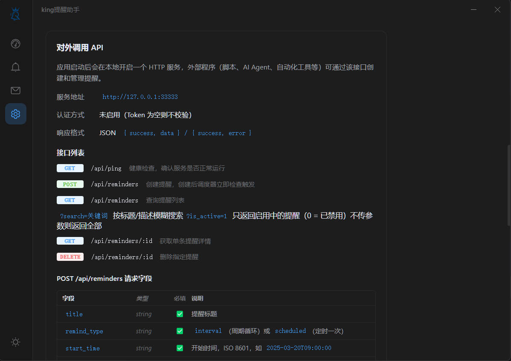

<p align="center">
  
</p>

<h1 align="center">King 提醒助手</h1>

<p align="center">
  <b>功能丰富的 Windows 桌面提醒应用，支持多渠道通知、农历提醒与外部 API 集成</b>
</p>

<p align="center">
  
  
  
  
  
</p>

<br />

## 界面预览

<table>
  <tr>
    <td></td>
    <td></td>
    <td></td>
  </tr>
  <tr>
    <td></td>
    <td></td>
    <td></td>
  </tr>
  <tr>
    <td></td>
    <td></td>
    <td></td>
  </tr>
</table>

<br />

## 创作初衷

### 在快节奏的时代，我们都在与"遗忘"抗争

现代生活的节奏越来越快，信息爆炸、任务繁重、压力剧增。我们的大脑每天都在处理海量信息，而**遗忘**，这个人类与生俱来的弱点，在数字时代被无限放大。

#### 那些被遗忘的重要时刻

- 💧 **健康管理的缺失** —— 连续工作数小时忘记喝水，直到身体发出警报才意识到自我关怀的重要性
- 🎂 **情感连接的断裂** —— 至亲好友的生日、纪念日等特殊时刻，因为忙碌而被搁置，事后追悔莫及
- 💕 **仪式感的消逝** —— 那些承载着爱与承诺的纪念日被忽略，让珍贵的关系蒙上遗憾的阴影
- 🏋️ **自律计划的夭折** —— 健身、阅读、学习的计划一次次被推迟，"下次一定"成了最无奈的借口
- 📝 **灵感的稍纵即逝** —— 脑海中闪现的创意和待办事项，没有及时记录便永远消失在时间的洪流中

#### 从个人痛点到产品使命

这不仅仅是一个提醒工具，而是**对现代人健忘症候群的温柔救赎**。

我们相信：

> **真正重要的不是提醒本身，而是那些被记住的瞬间所承载的价值** ——
> 一杯水的关怀，一句生日祝福的温暖，一次健身的坚持，一份纪念日的仪式感。

**King 提醒助手** 由此诞生。

它不只是一个冷冰冰的工具，而是你生活中的**数字管家**、**习惯教练**和**情感守护者**
。它将那些容易被遗忘的琐碎编织成一张温柔的守护网，让你在繁忙中不错过健康，在匆忙中不遗漏关爱，在忙碌中不失约自己。

**让科技有温度，让提醒有意义，让生活无遗憾。**

<br />

## 功能特性

### 提醒管理

- **循环提醒** — 按分钟 / 小时 / 天 / 月 / 年周期触发
- **定时提醒** — 指定日期时间一次性触发，触发后自动停用
- **农历提醒** — 支持按农历日期（如正月初一）设置提醒，每年自动换算阳历日期
- **星期筛选** — 周循环模式下指定星期几触发
- **工作日 / 节假日模式** — 内置中国法定节假日数据（`chinese-days`），可仅在工作日或仅在节假日触发
- **活跃时段** — 设定每日生效时间范围（如 09:00–18:00），避免非工作时间打扰
- **结束时间** — 可选设置提醒截止日期，到期自动停用
- **自定义图标 / 颜色** — 每条提醒可选独立 emoji 图标和颜色标识
- **托盘暂停** — 通过系统托盘一键暂停 / 恢复所有提醒

### 多渠道通知

每个提醒可同时启用多个通知渠道，每个渠道均支持独立配置和发送测试。

| 渠道           | 说明                                                                                          |
|:-------------|:--------------------------------------------------------------------------------------------|
| **桌面通知**     | 自定义浮窗（最多同时 3 条），支持提示音、自动消失、进度条动画                                                            |
| **邮件**       | SMTP 发送，支持 SSL/TLS，多收件人                                                                     |
| **Telegram** | Bot API 推送，支持多 Chat ID，支持 HTTP 代理                                                           |
| **企业微信**     | 应用消息推送，支持 `@all` 或指定用户，自动刷新 access_token                                                    |
| **Webhook**  | 自定义 HTTP 请求（GET/POST/PUT/PATCH），支持自定义 Header 和模板变量 `{{title}}` `{{body}}` `{{reminder_id}}` |

### 系统功能

- 亮色 / 暗色 / 跟随系统 三种主题
- 开机自启动
- 关闭窗口最小化到系统托盘
- 可调节调度检查间隔（默认 60 秒）
- 通知日志记录，支持查看与清理
- **Headless 模式** — 无界面纯后台运行，仅保留托盘图标，适合服务器或静默启动
- **本地 HTTP API** — 供外部程序（脚本、AI Agent 等）通过 REST 接口创建和管理提醒

<br />

## 技术栈

| 分类   | 技术                     |
|:-----|:-----------------------|
| 桌面框架 | Electron 33            |
| 前端   | Vue 3 + TypeScript     |
| 构建   | electron-vite + Vite   |
| UI   | Element Plus           |
| 状态管理 | Pinia                  |
| 数据库  | sql.js（SQLite）         |
| 节假日  | chinese-days           |
| 邮件   | Nodemailer             |
| HTTP | Axios                  |
| 样式   | SCSS                   |
| 打包   | electron-builder（NSIS） |

<br />

## 快速开始

### 环境要求

- Node.js >= 18
- npm

### 安装与运行

```bash
# 克隆项目
git clone https://github.com/coder-kingyifan/king-remind.git
cd king-remind

# 安装依赖
可以设置一个国内镜像源：
npm config set registry https://registry.npmmirror.com
进行安装
npm install

# 启动开发模式（带界面）
npm run dev

# 启动 Headless 模式（仅后台服务）
npm run dev:headless
```

> 按 `F12` 打开开发者工具

### 构建打包

```bash
npm run build       # 编译前端和主进程
npm run pack        # 打包 Windows 安装程序 (NSIS)
npm run pack:dir    # 打包为免安装目录
```

产物输出到 `dist/` 目录。

<br />

## Docker 部署

适用于 Linux 服务器、NAS、云主机等无图形界面环境，以 Headless 模式运行后台服务（调度器 + HTTP API）。

### 环境要求

- Docker
- Docker Compose

### 快速启动

```bash
# 克隆项目
git clone https://github.com/coder-kingyifan/king-remind.git
cd king-remind

# 构建并启动（后台运行）
docker compose up -d --build
```

### 验证服务

```bash
curl http://localhost:33333/api/ping
# 返回: {"success":true,"data":{"message":"pong","version":"1.0.0"}}
```

### 常用命令

```bash
docker compose logs -f          # 查看实时日志
docker compose restart          # 重启服务
docker compose down             # 停止并移除容器
docker compose up -d --build    # 重新构建并启动
```

### 自定义端口

默认 API 端口为 `33333`，可通过环境变量修改：

```bash
API_PORT=30000 docker compose up -d
```

或创建 `.env` 文件：

```
API_PORT=30000
```

### 数据持久化

数据库文件存储在 Docker volume `remind-data` 中（挂载路径 `/app/data`），**停止或删除容器不会丢失数据**。

如需备份数据库：

```bash
docker cp king-remind:/app/data/remind.db ./remind.db.bak
```

### 环境变量

| 变量         | 默认值         | 说明                               |
|:-----------|:------------|:---------------------------------|
| `API_HOST` | `127.0.0.1` | API 监听地址，Docker 中自动设为 `0.0.0.0`  |
| `API_PORT` | `33333`     | 宿主机映射端口                          |
| `DB_DIR`   | 当前目录        | 数据库文件目录，Docker 中自动设为 `/app/data` |

<br />

## Headless 模式

不创建主窗口，仅运行后台服务（数据库、调度器、API Server）并保留系统托盘图标（仅显示退出菜单）。

适用场景：

- 开机静默启动，不弹出界面
- 无显示器环境运行
- 仅通过 HTTP API 管理提醒

```bash
king提醒助手.exe --headless
```

<br />

## HTTP API

应用启动后在本地开启 REST API（默认端口 `33333`），支持可选 Bearer Token 认证。

```bash
# 健康检查
curl http://127.0.0.1:33333/api/ping

# 创建定时提醒
curl -X POST http://127.0.0.1:33333/api/reminders \
  -H "Content-Type: application/json" \
  -d '{"title":"喝水","remind_type":"scheduled","start_time":"2025-06-01T10:00:00","channels":["desktop"]}'

# 创建循环提醒（工作日 09:00-18:00 每 30 分钟）
curl -X POST http://127.0.0.1:33333/api/reminders \
  -H "Content-Type: application/json" \
  -d '{"title":"活动一下","remind_type":"interval","start_time":"2025-06-01T09:00:00","interval_value":30,"interval_unit":"minutes","workday_only":true,"active_hours_start":"09:00","active_hours_end":"18:00","channels":["desktop","webhook"]}'

# 获取所有激活的提醒
curl http://127.0.0.1:33333/api/reminders?is_active=1

# 删除提醒
curl -X DELETE http://127.0.0.1:33333/api/reminders/42
```

完整接口文档见 [API.md](./API.md)。

<br />

## 项目结构

```
king-remind/
├── electron/
│   ├── main/                  # 主进程
│   │   ├── index.ts           # 入口，窗口 / 托盘 / 调度器初始化
│   │   ├── tray.ts            # 系统托盘
│   │   ├── scheduler.ts       # 提醒调度器（含农历 / 工作日判定）
│   │   ├── ipc-handlers.ts    # IPC 通信处理
│   │   ├── api-server.ts      # 本地 HTTP API 服务
│   │   ├── db/                # 数据库层（SQLite CRUD / 迁移）
│   │   └── notifications/     # 通知渠道（桌面 / 邮件 / TG / 企微 / Webhook）
│   └── preload/               # 预加载脚本（contextBridge）
├── src/
│   ├── pages/                 # 页面：仪表盘 / 提醒管理 / 通知配置 / 系统设置
│   ├── components/            # 布局组件 / 提醒表单
│   ├── stores/                # Pinia 状态管理
│   ├── types/                 # TypeScript 类型定义
│   ├── router/                # 路由配置
│   └── assets/                # SCSS 样式 / 静态资源
├── resources/                 # 应用图标 / 提示音
├── API.md                     # HTTP API 文档
├── electron.vite.config.ts
├── electron-builder.yml
└── package.json
```

<br />

## 配置指南

<details>
<summary><b>Telegram</b></summary>
<br />

1. 在 Telegram 搜索 **@BotFather**，发送 `/newbot` 创建机器人，获取 **Bot Token**
2. 搜索 **@userinfobot**，发送任意消息获取你的数字 **Chat ID**
3. 给你创建的机器人发送 `/start` 启动对话
4. 在应用「通知渠道 → Telegram」中填入 Bot Token 和 Chat ID（支持多个，逗号分隔）
5. 国内网络需填写代理地址（如 `http://127.0.0.1:7890`）

</details>

<details>
<summary><b>邮件（SMTP）</b></summary>
<br />

在「通知渠道 → 邮件」中填写 SMTP 服务器信息：

| 邮箱     | SMTP 服务器       | 端口  | SSL |
|:-------|:---------------|:----|:----|
| QQ 邮箱  | smtp.qq.com    | 465 | 是   |
| 163 邮箱 | smtp.163.com   | 465 | 是   |
| Gmail  | smtp.gmail.com | 587 | 否   |

> 密码字段填写邮箱的**授权码**（非登录密码）。收件人支持多个地址，逗号分隔。

</details>

<details>
<summary><b>企业微信</b></summary>
<br />

1. 在 [企业微信管理后台](https://work.weixin.qq.com/) 创建应用
2. 获取 **企业 ID**（Corp ID）、**应用 Secret** 和 **Agent ID**
3. 在应用「通知渠道 → 企业微信」中填写以上信息
4. 接收者填 `@all`（全员）或用 `|` 分隔的用户 ID

</details>

<details>
<summary><b>Webhook</b></summary>
<br />

在「通知渠道 → Webhook」中填写接收地址。支持自定义 HTTP 方法（GET/POST/PUT/PATCH）和请求头。

默认请求体：

```json
{
  "title": "提醒标题",
  "body": "提醒内容",
  "icon": "🔔",
  "reminderId": 42
}
```

也可自定义模板，使用 `{{title}}`、`{{body}}`、`{{reminder_id}}` 变量。

</details>

<br />

## 许可证

[MIT License](LICENSE)

## 联系

**作者**：kingyifan
&nbsp;&middot;&nbsp;
[GitHub](https://github.com/coder-kingyifan)
&nbsp;&middot;&nbsp;
[Issues](https://github.com/coder-kingyifan/king-remind/issues)

---

## 特别鸣谢

[Linux.do](https://linux.do/)

<p align="center">
  如果这个项目对你有帮助，欢迎给一个 Star
</p>

<p align="center">
  <a href="https://www.star-history.com/#coder-kingyifan/king-remind&type=date&legend=top-left">
    
  </a>
</p>
